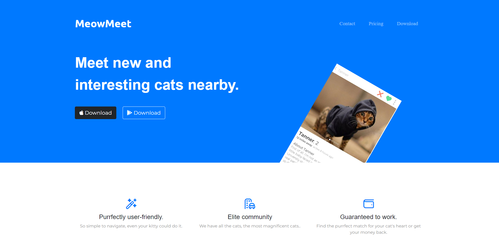
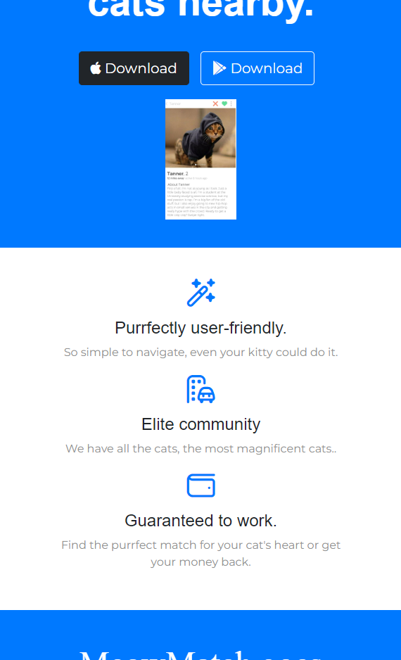

# MeowMatch

MeowMatch is a delightful online platform designed exclusively for cats to find their purrfect match. It provides a fun and interactive space where feline companions can connect, socialize, and explore potential relationships.

## Technologies Used
MeowMatch is built using HTML, CSS, and Bootstrap, ensuring a visually appealing and responsive user interface. The combination of these technologies creates an engaging and seamless user experience.

## Local Installation
To install MeowMatch locally, follow these steps:
1. Clone the repository from GitHub: `git clone https://github.com/AhmedHamza667/MeowMatch.git`
2. Navigate to the project directory: `cd MeowMatch`
3. Open the file index.html

## Contributing
We warmly welcome contributions from the community to make MeowMatch even better. If you would like to contribute, please follow these steps:
1. Fork the repository on GitHub.
2. Create a new branch for your feature or bug fix.
3. Implement the changes and commit them.
4. Push the changes to your forked repository.
5. Open a pull request, providing a detailed description of the changes you've made.

## Main Contributor
Ahmed Hamza has been the driving force behind MeowMatch, leading its development and continuously improving the platform to enhance the feline dating experience.

## License
MeowMatch is currently not licensed.

Feel free to explore MeowMatch and let your furry friends embark on their romantic adventures!

